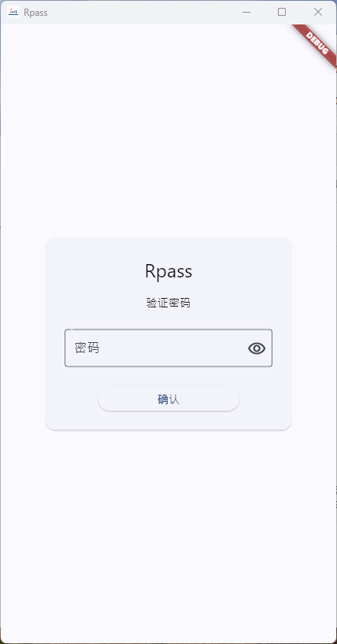

# Rpass 2.0

快捷的密码记录程序

---

## 预览




## 功能支持

- [CHANGELOG](/CHANGELOG.md)

## 安全

-   采用 kdbx 加密存储
-   https://github.com/authpass/kdbx.dart

## 开发/测试

-   当前环境

```
flutter doctor -v

[✓] Flutter (Channel stable, 3.29.0, on macOS 13.6.5 22G621 darwin-arm64, locale zh-Hans-CN) [387ms]
    • Flutter version 3.29.0 on channel stable at /Users/admin/flutter
    • Upstream repository https://github.com/flutter/flutter.git
    • Framework revision 35c388afb5 (9 days ago), 2025-02-10 12:48:41 -0800
    • Engine revision f73bfc4522
    • Dart version 3.7.0
    • DevTools version 2.42.2

[✓] Android toolchain - develop for Android devices (Android SDK version 35.0.1) [2.4s]
    • Android SDK at /Volumes/extend/Android/sdk
    • Platform android-35, build-tools 35.0.1
    • Java binary at: /Volumes/extend/Application/Android Studio.app/Contents/jbr/Contents/Home/bin/java
      This is the JDK bundled with the latest Android Studio installation on this machine.
      To manually set the JDK path, use: `flutter config --jdk-dir="path/to/jdk"`.
    • Java version OpenJDK Runtime Environment (build 21.0.5+-12932927-b750.29)
    • All Android licenses accepted.

[!] Xcode - develop for iOS and macOS (Xcode 15.2) [864ms]
    • Xcode at /Applications/Xcode.app/Contents/Developer
    • Build 15C500b
    ✗ Unable to get list of installed Simulator runtimes.
    • CocoaPods version 1.16.2

[✓] Chrome - develop for the web [10ms]
    • Chrome at /Applications/Google Chrome.app/Contents/MacOS/Google Chrome

[✓] Android Studio (version 2024.2) [9ms]
    • Android Studio at /Volumes/extend/Application/Android Studio.app/Contents
    • Flutter plugin can be installed from:
      🔨 https://plugins.jetbrains.com/plugin/9212-flutter
    • Dart plugin can be installed from:
      🔨 https://plugins.jetbrains.com/plugin/6351-dart
    • android-studio-dir = /Volumes/extend/Application/Android Studio.app
    • Java version OpenJDK Runtime Environment (build 21.0.5+-12932927-b750.29)

[✓] VS Code (version 1.97.2) [8ms]
    • VS Code at /Applications/Visual Studio Code.app/Contents
    • Flutter extension version 3.104.0

[✓] Connected device (3 available) [7.0s]
    • macOS (desktop)                 • macos                 • darwin-arm64   • macOS 13.6.5 22G621 darwin-arm64
    • Mac Designed for iPad (desktop) • mac-designed-for-ipad • darwin         • macOS 13.6.5 22G621 darwin-arm64
    • Chrome (web)                    • chrome                • web-javascript • Google Chrome 133.0.6943.99

[✓] Network resources [2.0s]
    • All expected network resources are available.

```

-   安装依赖

```bash
flutter pub get
```

-   生成 gen_l10n

```bash
flutter gen-l10n
```

-   运行项目

```bash
flutter run
```
